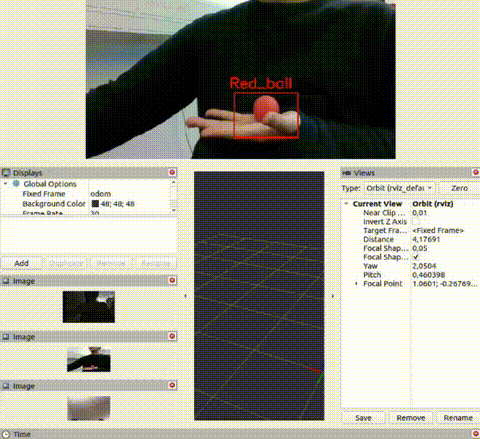

# 🤖 Autonomous Mobile Pick and Place Robot

## Overview
The robot, **Happy**, is an autonomous mobile robot system designed to detect, classify, pick up, and place objects into designated boxes based on ArUco marker identification.  

The robot operates fully onboard without external computation, navigating within a defined workspace while avoiding obstacles and maximizing task efficiency.

  

  

  

## Features
- 📦 Detects and classifies objects into three categories (Cubes, Balls, Animals)
- 🏷️ Identifies target boxes using ArUco markers
- 🤖 Plans grasps and executes pick-and-place maneuvers
- 🚧 Avoids obstacles and respects workspace limits
- 🗺️ Localizes and maps environment
- 🌳 Behaviour Tree for decision making

## Developed by
- Jordan Bierbrier
- Kei Ikemura
- Mael Arrivé
- Zhinan Gao